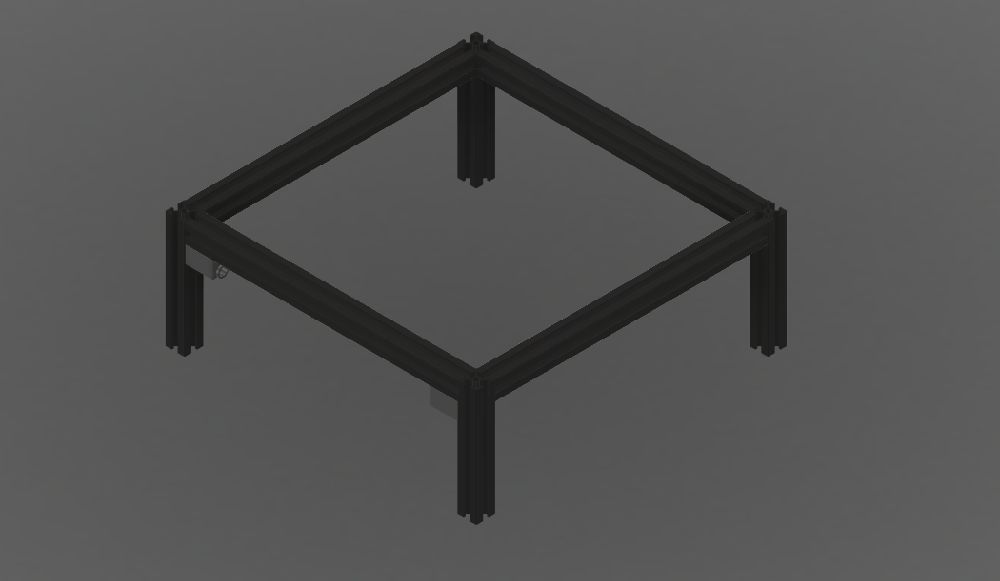

# openDraw is a new, open-source drawing machine which I'm developing in my free time!

## Development

30/10/2022
Frame designed. 2020 extrusion. 280mm Horizontals and 120mm Verticals.

The grey printed parts in the corners are holders for the X and Y 8mm linear rods. Only two of them are in the picture above but there are 8 total. They are currently designed for 250mm linear rods as that is all I can get at the moment but once I can get 275mm linear rods I will adjust these parts in order to make use of as much of the available space as possible.